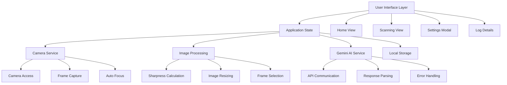
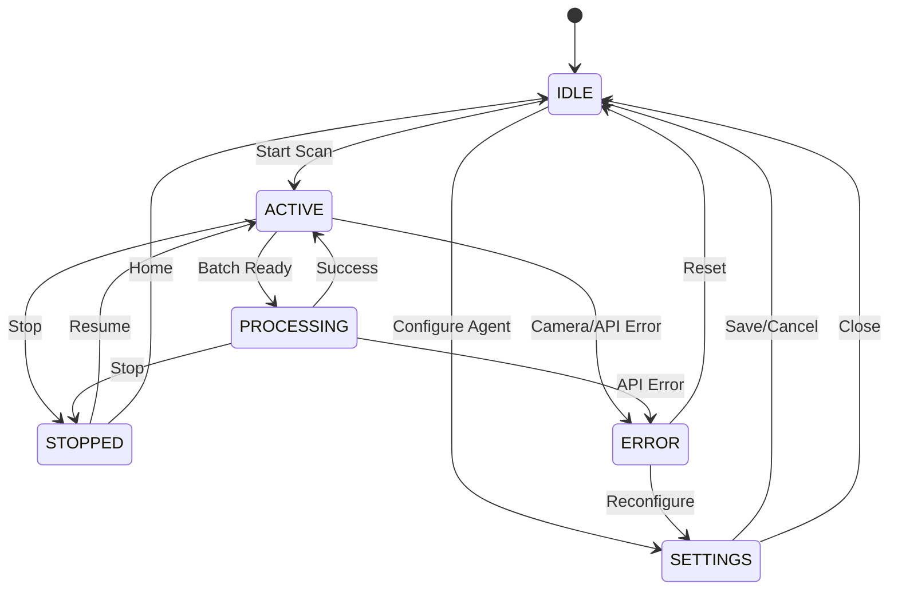
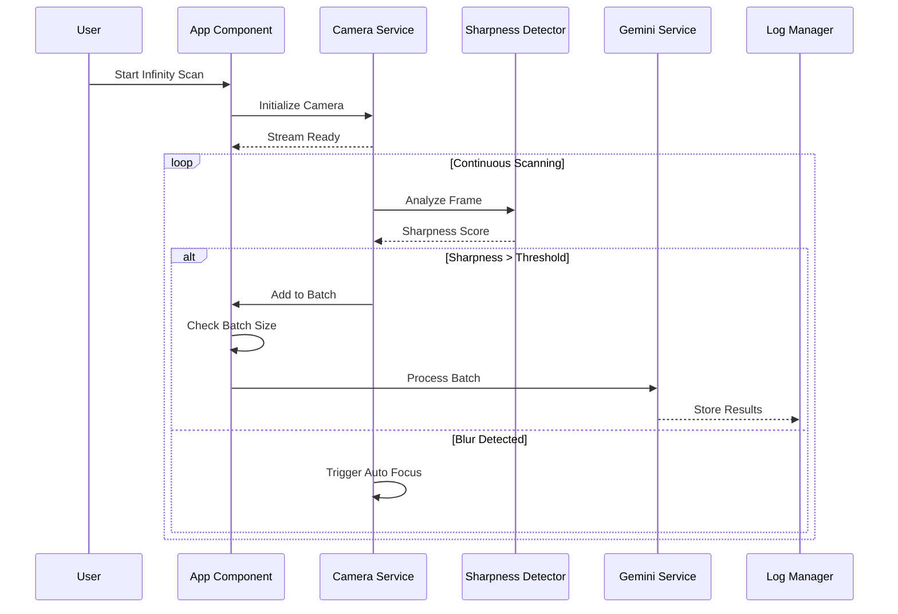
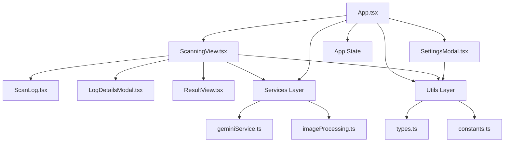
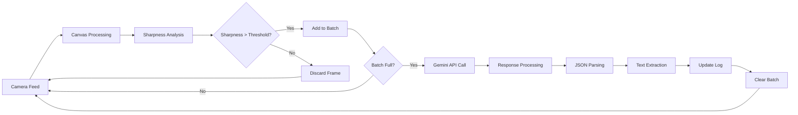
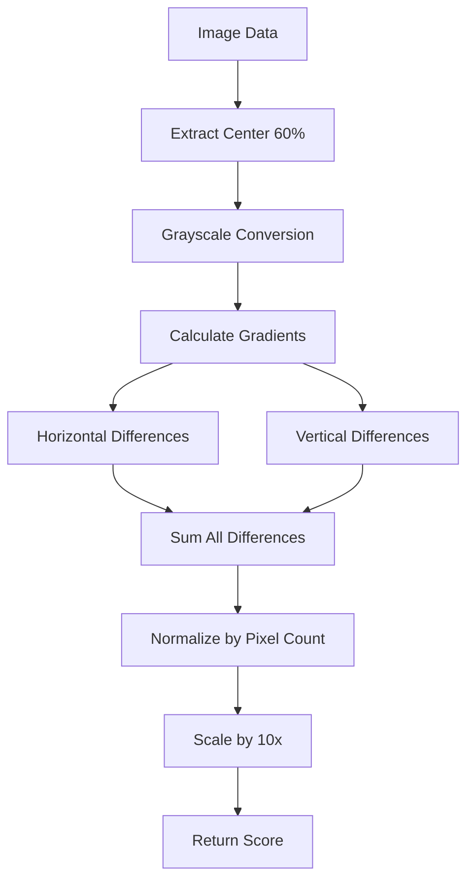
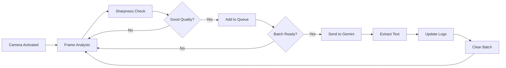
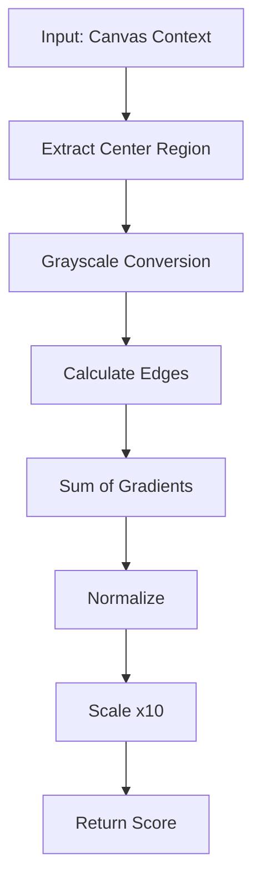
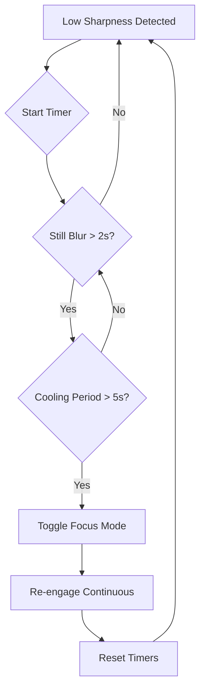
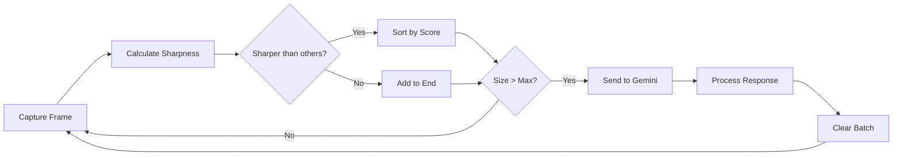

# Gemini Infinity OCR Scanner

## Overview

**Gemini Infinity Scanner** is a continuous, agentic OCR (Optical Character Recognition) application that leverages Google's Gemini AI to extract text from live camera feeds. The app automatically captures the sharpest frames, processes them in batches, and loops indefinitely for real-time text extraction.

### Key Features

- **Continuous Scanning**: Infinite loop OCR with automatic frame capture
- **Smart Sharpness Detection**: Only captures high-quality frames using edge detection algorithms
- **Batch Processing**: Sends multiple frames to Gemini AI for efficient text extraction
- **Configurable Prompts**: Choose from presets (Standard OCR, Text-Only, Code/ID, Markdown) or create custom instructions
- **Multiple Gemini Models**: Support for various Gemini models (2.5 Flash, 2.0 Flash Exp, 1.5 Pro, etc.)
- **Real-time Logs**: Live log view with thumbnails, extracted text, and status indicators
- **Download Results**: Export extracted text as TXT or JSON files
- **Responsive UI**: Dark theme with mobile-friendly design
- **Auto-Focus**: Attempts to trigger camera re-focus when blur is detected
- **Client-side Processing**: All processing happens in the browser for privacy

## Architecture Overview



## Application Flow



## Core Scanning Process



## Component Architecture



## Data Flow



## Sharpness Detection Algorithm



## Technology Stack

- **Frontend**: React 19, TypeScript, Vite
- **AI**: Google Gemini AI (@google/genai)
- **Styling**: Tailwind CSS
- **Icons**: Lucide React
- **Build Tool**: Vite

## Prerequisites

- Node.js (v16 or higher)
- A Google Gemini API key (get one from [Google AI Studio](https://aistudio.google.com/))

## Installation

1. **Clone the repository**:
   ```bash
   git clone <repository-url>
   cd gemini-infinity-ocr-scanner
   ```

2. **Install dependencies**:
   ```bash
   npm install
   ```

3. **Configure API Key**:
   - Launch the app (`npm run dev`)
   - Click "Configure Agent" on the home screen
   - Enter your Gemini API key in the settings modal
   - The key is stored locally in your browser

## Usage

### Getting Started

1. **Open the app** in your browser after running `npm run dev`
2. **Grant camera permissions** when prompted
3. **Configure settings** (API key, model, prompt, batch size, capture speed)
4. **Start scanning** by clicking "Start Infinity Scan"

### Configuration Options

- **API Key**: Your Google Gemini API key
- **Model**: Choose from available Gemini models (2.5 Flash recommended for speed/cost)
- **System Prompt**: Select a preset or write custom instructions for text extraction
- **Batch Size**: Number of frames to send per OCR request (1-20)
- **Capture Speed**: Interval between frame captures (0.1s - 2.0s)

### Scanning Process



### Viewing Results

- **Live Log**: See real-time scan results with thumbnails
- **Details Modal**: Click any log entry for full details, copy text, or download JSON
- **Status Indicators**: Green for success, red for errors, yellow for pending

## Development

### Available Scripts

- `npm run dev` - Start development server
- `npm run build` - Build for production
- `npm run preview` - Preview production build

### Project Structure

```
├── components/          # React components
│   ├── ScanningView.tsx
│   ├── SettingsModal.tsx
│   ├── ScanLog.tsx
│   ├── LogDetailsModal.tsx
│   └── ResultView.tsx
├── services/            # Business logic
│   ├── geminiService.ts
│   └── imageProcessing.ts
├── types.ts             # TypeScript type definitions
├── constants.ts         # App constants and presets
├── App.tsx              # Main app component
└── index.tsx            # React entry point
```

## Core Algorithms

### 1. Sharpness Detection

The app uses a simplified Laplacian variance calculation optimized for real-time performance:



### 2. Auto-Focus Logic

When blur is detected, the app attempts to trigger camera re-focus:



### 3. Batch Processing

The app optimizes OCR by collecting multiple high-quality frames:



## Browser Compatibility

- Modern browsers with camera API support (Chrome, Firefox, Safari, Edge)
- Requires HTTPS for camera access (except localhost)
- WebGL support for canvas operations

## Privacy & Security

- All processing happens client-side in your browser
- Images are not stored or transmitted except to Gemini AI API
- API key is stored locally in browser localStorage
- No data collection or tracking

## Contributing

1. Fork the repository
2. Create a feature branch
3. Make your changes
4. Test thoroughly
5. Submit a pull request

## License

This project is licensed under the MIT License - see the LICENSE file for details.

## Acknowledgments

- Powered by [Google Gemini AI](https://ai.google.dev/)
- Built with [React](https://reactjs.org/) and [Vite](https://vitejs.dev/)
- Icons by [Lucide](https://lucide.dev/)
